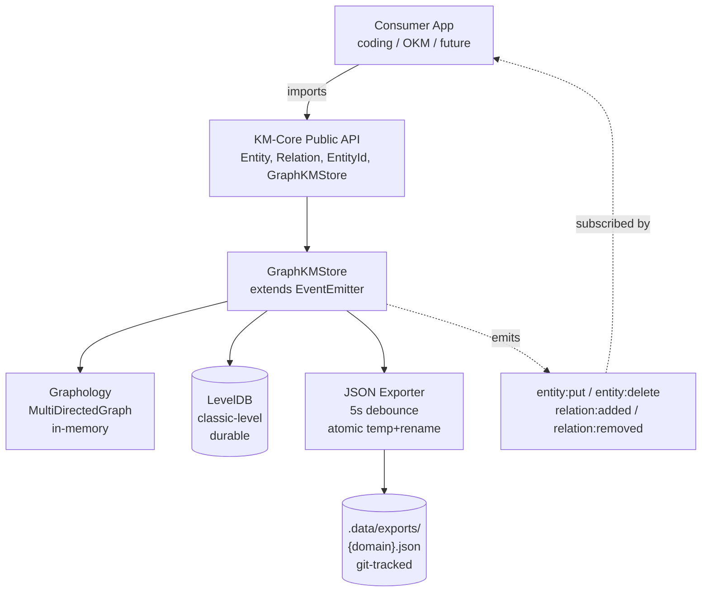

# @fwornle/km-core

Shared knowledge-management core: canonical `Entity` / `Relation` types, a `GraphKMStore` adapter (Graphology in-memory + LevelDB durable + git-tracked per-domain JSON exports), and a UUIDv7-based identifier scheme.

**Status:** v0.1 — under active development. Not yet published to npm; consumed as a git submodule.

## Architecture



## Install

KM-Core is currently consumed via git submodule, not npm:

```bash
cd path/to/your/repo
git submodule add git@github.com:fwornle/km-core.git lib/km-core
cd lib/km-core
npm install
npm run build
```

## Build

```bash
npm install
npm run build
```

Compiles TypeScript to `dist/`. ESM-only (`type: module`).

## Test

```bash
npm test          # vitest run
npm run test:watch
```

Vitest 4.x with `environment: node`. Integration tests under `tests/integration/` exercise byte-equal round-trip parity against frozen fixtures in `tests/fixtures/`.

## Public API

```typescript
import {
  // Types
  type Entity,
  type Relation,
  type Layer,
  type EntityId,
  type SerializedGraph,
  type BatchOp,
  type FilterObject,
  // Identifier helpers
  mintEntityId,
  parseEntityId,
  // Store
  GraphKMStore,
  type GraphKMStoreOptions,
} from '@fwornle/km-core';
```

`GraphKMStore` extends Node's `EventEmitter` and fires `entity:put`, `entity:delete`, `relation:added`, `relation:removed` events for consumers (e.g. Redis pub/sub bridges) to subscribe to.

## Per-domain Export Contract

The store writes one JSON file per ontology lower-domain into the configured `exportDir`:

```
exportDir/
  raas.json
  kpifw.json
  general.json
  coding.json
  ...
```

Each file mirrors Graphology's `SerializedGraph` shape and is written atomically (temp file + rename). Writes are debounced 5s after the last mutation.

## License

MIT — see [LICENSE](./LICENSE).

## Contributing

See [CONTRIBUTING.md](./CONTRIBUTING.md). Notable constraint: no `console.*` calls in source — use `process.stderr.write()` or a caller-supplied logger.
